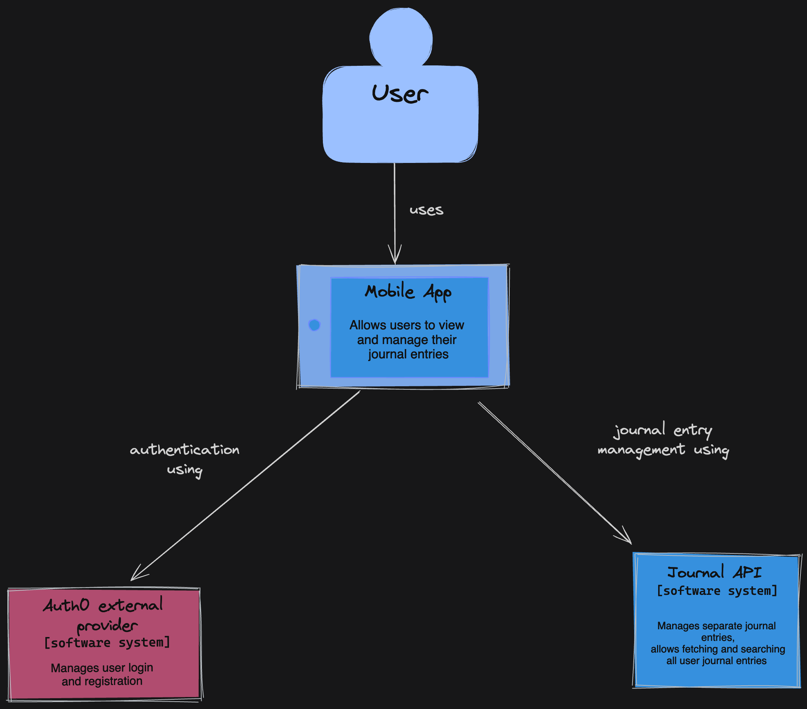
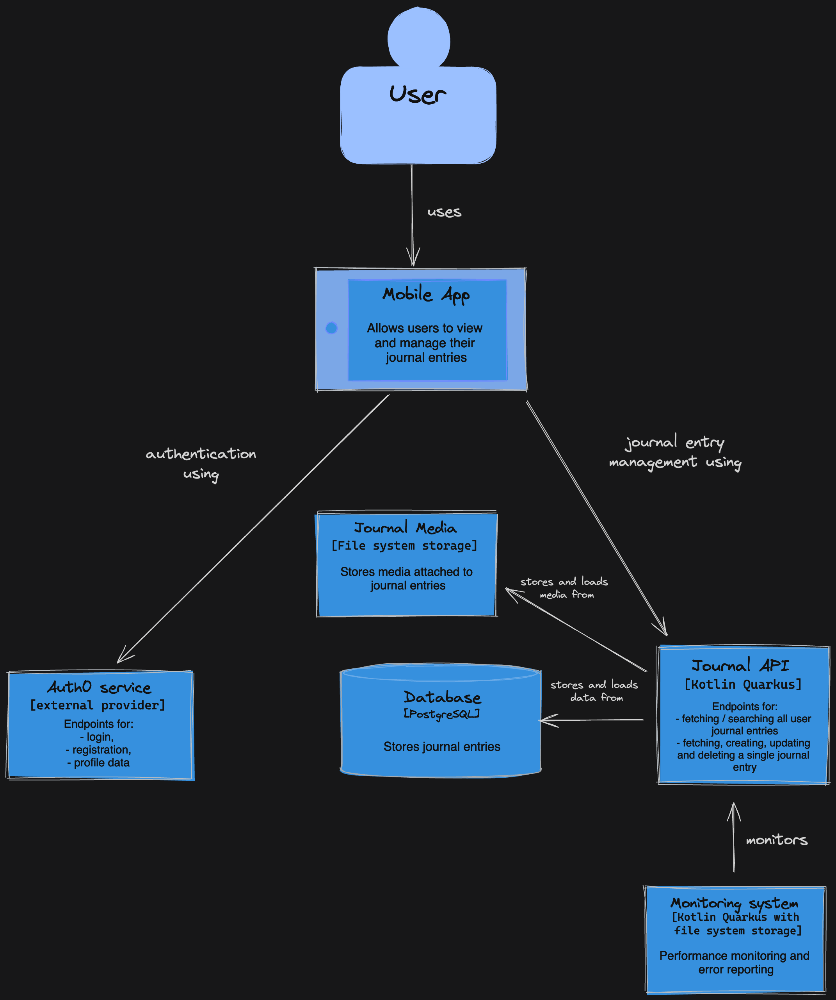

# TravelJournal

## TravelJournalAPI

API for a travel journal where users can note down their travel adventures. 

Supports following features:
- Journal Entry Management - endpoints to create, read, update and delete journal entries
- List All Journal Entries - endpoint for returning all journal entries belonging to a user as a paginated list
- Journal Entry Search - endpoint for searching through journal entries by title/description
- Authentication and Authorization - endpoints for registration, login and fetching profile information
- Photos Integration - endpoints for uploading photos to journal entries

### C1 Diagram



### C2 Diagram



## Running the application in dev mode

This project uses Quarkus. You can run your application in dev mode that enables live coding using:

```shell script
./gradlew quarkusDev
```

> **_NOTE:_**  Quarkus now ships with a Dev UI, which is available in dev mode only at <http://localhost:8080/q/dev/>.

## Packaging and running the application

The application can be packaged using:

```shell script
./gradlew build
```

It produces the `quarkus-run.jar` file in the `build/quarkus-app/` directory.
Be aware that it’s not an _über-jar_ as the dependencies are copied into the `build/quarkus-app/lib/` directory.

The application is now runnable using `java -jar build/quarkus-app/quarkus-run.jar`.

If you want to build an _über-jar_, execute the following command:

```shell script
./gradlew build -Dquarkus.package.jar.type=uber-jar
```

The application, packaged as an _über-jar_, is now runnable using `java -jar build/*-runner.jar`.

## Creating a native executable

You can create a native executable using:

```shell script
./gradlew build -Dquarkus.native.enabled=true
```

Or, if you don't have GraalVM installed, you can run the native executable build in a container using:

```shell script
./gradlew build -Dquarkus.native.enabled=true -Dquarkus.native.container-build=true
```

You can then execute your native executable with: `./build/travel-journal-1.0.0-SNAPSHOT-runner`
